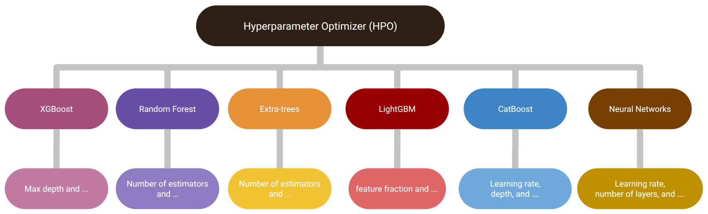
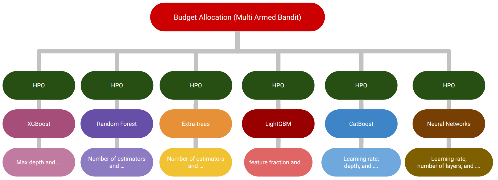

# CASH with Bandits
Pull in CASH with Bandits: Max K-Armed Bandit for the CASH
problem in Automated Machine Learning

## Abstract
The Combined Algorithm Selection and Hyperparameter optimization (CASH) is a challenging resource allocation problem in the field of AutoML. We propose MaxUCB, a max $k$-armed bandit method to trade off exploring different model classes and conducting hyperparameter optimization (HPO). MaxUCB is specifically designed for the light-tailed and bounded reward distributions arising in this setting and, thus, provides an efficient alternative compared to classic max $k$-armed bandit methods assuming heavy-tailed reward distributions. We theoretically and empirically evaluate our method on four standard AutoML benchmarks demonstrating superior performance over prior approaches.

## Overview

### 1. **Combined Search**  
This method involves combining all model-specific hyperparameters into a single, unified search space:  
- Introduce a **conditional categorical hyperparameter** to represent model selection.  
- Combine this conditional hyperparameter with all models' hyperparameters.  
- Perform HPO over the entire search space.  

This approach, while comprehensive, can suffer from inefficiencies due to the high dimensionality of the combined search space.  
  
*HPO results for combined search:*  
  

---

### 2. **Decomposed Search with Bandits**  
In this approach, HPO is conducted separately for each machine learning model:  
- The search space for each HPO is smaller, leading to more focused optimization.  
- However, managing excessive computation budgets across models is necessary.  

To address this, we employ a **multi-armed bandit strategy** to allocate budgets efficiently.  
  
*HPO results for decomposed CASH without budget allocation:*  


---

By using MaxUCB, we strike a balance between model exploration and hyperparameter optimization, reducing computational overhead while maintaining performance.  

## **Project Structure**  
The repository is organized as follows:

├── HPO_Runs/ # Scripts and configurations for generating HPO trajectories 
├── Bandits/ # Code for applying bandit algorithms on the generated HPO trajectories 
├── assets/ # Visuals and diagrams for illustrating approaches 
├── README.md # Project overview and documentation


## Dependency

Using a Conda environment is recommended.

You may need to install and set up the TabRepo and YAHPO gym packages.

TabRepo: https://github.com/autogluon/tabrepo

YAHPO gym: https://github.com/slds-lmu/yahpo_gym


To install the repository, ensure you are using Python 3.9-3.11. Other Python versions may not be supported. Then, run the following commands:

```bash
pip install -r requirements.txt
```

Only Linux support has been tested.

## Running expiriments
To run experiments, execute the following command:

```bash
python main.py 
```


## **Contributions**  
We welcome feedback and contributions! Please submit an issue or a pull request to help improve this repository.  Feel free to adapt and extend this codebase as needed for your own experiments and research.